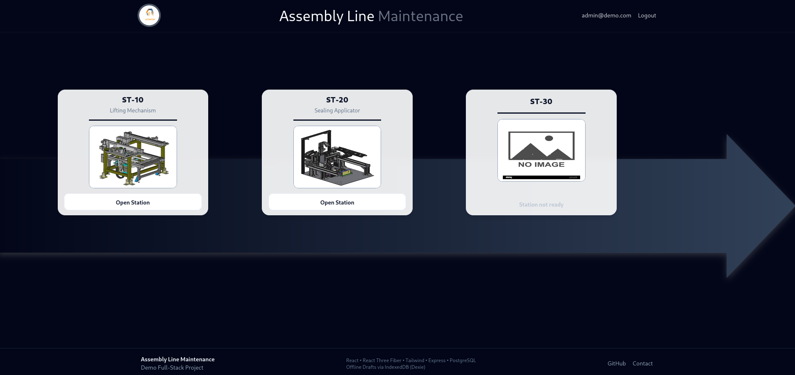
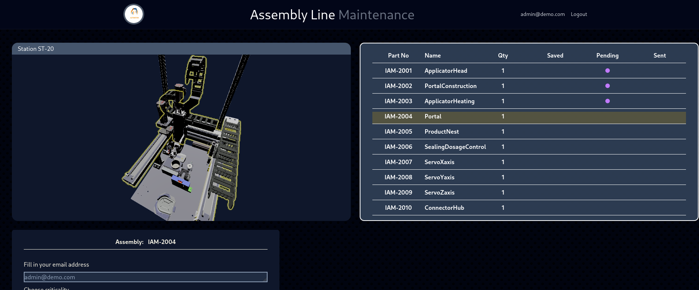
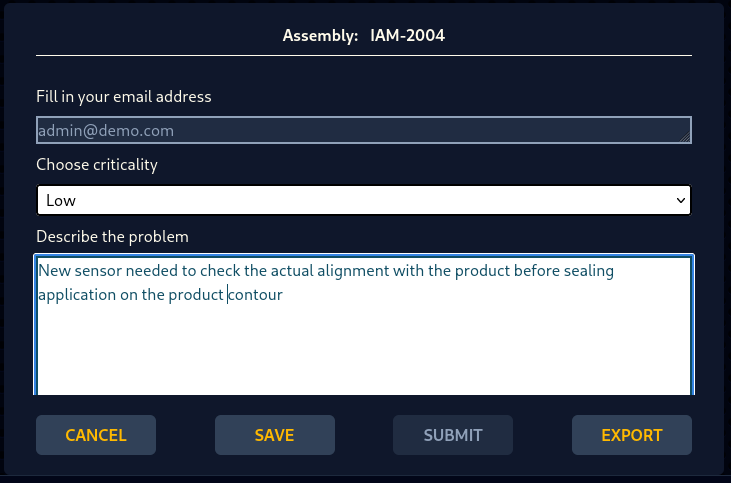
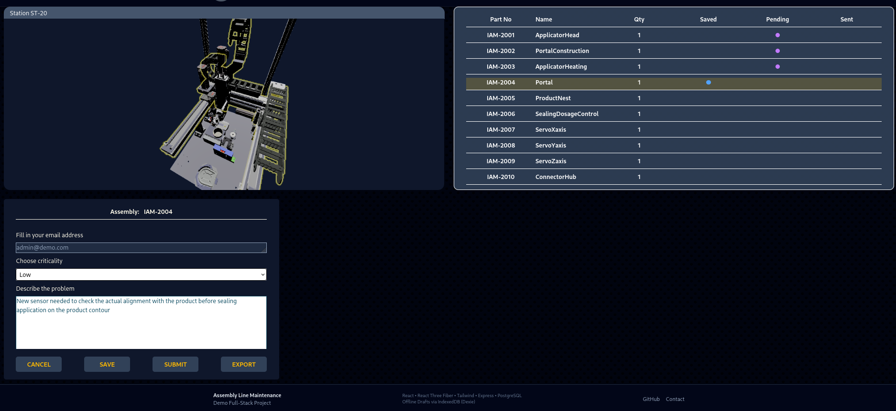
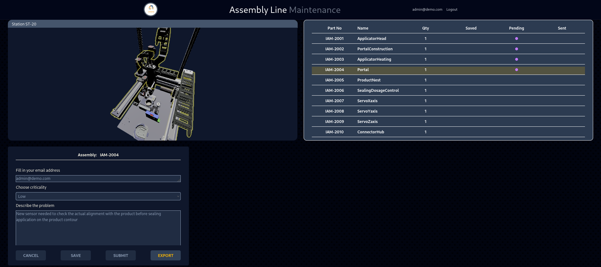

# Assembly Line Maintenance --- Fullstack Demo

Interactive maintenance dashboard with **3D station visualization**,  
**role-based access**, and **offline-capable workflows**.

This project demonstrates a full-stack architecture built with  
**React**, **React Three Fiber**, **Express**, and **PostgreSQL**.

The system supports resilient operation through:

- automatic **fallback to a seeded PostgreSQL database** for authentication
- **IndexedDB (Dexie) draft storage** when the API or live database is unavailable

This allows the application to remain usable even when the API or live database is 
temporarily unavailable.


------------------------------------------------------------------------

# Live Demo

Frontend (Vercel)

https://project-maintenance-drab.vercel.app

Backend API (Render)

https://project-maintenance.onrender.com

Database

Neon PostgreSQL

------------------------------------------------------------------------

## Screenshots

# Station Overview


# Highlighting subassembly activates partform report


# Issue Reporting Form


# Partform saved


# Partform submitted



------------------------------------------------------------------------

## System architecture

```
Frontend (React + Three.js)
        |
        v
   Express API
        |
   PostgreSQL
   /        \
Live DB    Offline Seeded DB
        |
     Dexie

```
------------------------------------------------------------------------     

# Features

## Authentication

-   User registration
-   Secure login using **bcrypt password hashing**
-   Role-based access control
-   Persistent login using **Zustand + localStorage**

## Station Visualization

-   Interactive **3D assembly line viewer**
-   Built using **React Three Fiber**
-   Hover highlighting of assemblies
-   Clickable assemblies open issue reporting form

## Issue Reporting

Users can report technical issues directly from the 3D station
interface.

Issue report includes:

-   assembly ID
-   criticality level
-   description
-   user email
-   station reference

Submitted issues are stored in **PostgreSQL**.

## Draft Persistence (Offline Mode)

If the API or live database is unavailable:

-   Issue drafts are automatically saved to **IndexedDB (Dexie)**
-   Drafts persist between sessions
-   Drafts can later be exported via API

```bash
    User submits issue   
          ↓ 
    API reachable? 
        /    \
      YES     NO 
       ↓      ↓ 
    Neon DB   Dexie Draft
```

## Admin Dashboard

Administrators have access to a simple issue management dashboard.

Features:

-   view all reported issues
-   soft delete issues
-   recall deleted issues
-   monitor issue lifecycle

Issue statuses:

open deleted

Soft deletion ensures issue history remains preserved.

------------------------------------------------------------------------

# Tech Stack

## Frontend

-   React
-   Vite
-   TailwindCSS
-   React Router
-   React Three Fiber / Drei / Postprocessing
-   Dexie (IndexedDB)

## Backend

-   Node.js
-   Express
-   PostgreSQL (`pg` Pool)
-   bcrypt password hashing

## Persistence

-   PostgreSQL (Live database)
-   Docker Seeded PostgreSQL (Offline fallback)
-   IndexedDB drafts (Dexie)

## Infrastructure / Deployment

Frontend: Vercel\
Backend: Render\
Database: Neon PostgreSQL\
Offline DB: Docker PostgreSQL

------------------------------------------------------------------------

# Architecture Overview

The backend supports **two database modes**:

### Live Database

Local PostgreSQL running on port `5432`.

### Offline Seeded Database (Docker)

Used when live DB is not available.

Server startup logic:

1. Attempt connection to **Live PostgreSQL (5432)**
2. If the connection fails, switch to **Offline Seeded PostgreSQL (Docker, 5433)**
3. Authentication continues working even when the live database is unavailable

------------------------------------------------------------------------

# Getting Started

## Install dependencies

Frontend
```bash
npm install

```

Backend
```bash
cd server npm install

```
------------------------------------------------------------------------

## Run Offline Database (Docker)

```bash
docker-compose up -d

```

Database runs on:

localhost:5433

------------------------------------------------------------------------

## Start Backend API

```bash
cd server npm start

```

API:

http://localhost:3001

------------------------------------------------------------------------

## Start Frontend

```bash
npm run dev

```
App:

http://localhost:5173

------------------------------------------------------------------------

# Demo Accounts

| id |     email       | password |     access     |
| -  |       -         |    -     |       -        |
| 1  | user1@demo.com  |   1234   |     ST-10      |
| 2  | user2@demo.com  |   1234   |     ST-20      |
| 3  | admin@demo.com  |   1234   |  All stations  |


------------------------------------------------------------------------

# Authentication Flow

1. User logs in via React form
2. Express verifies password using bcrypt
3. Server returns user profile and allowed station access
4. Zustand store persists login state
5. localStorage restores session after refresh

------------------------------------------------------------------------

# Role-Based Access

Access is controlled by database table:

station_access

Login endpoint loads allowed stations and returns them to frontend.

UI decides:

-   show/hide station button
-   enable/disable navigation

------------------------------------------------------------------------

# Draft Workflow (IndexedDB)

Issue drafts are stored locally using Dexie:

-   Works offline
-   Persists between sessions
-   Can export drafts via API endpoint

IndexedDB data is visible in:

Chrome DevTools -> Application -> IndexedDB

------------------------------------------------------------------------

# Notes

-   This is a demo portfolio project --- JWT/session auth not
    implemented yet.
-   Offline Docker DB exists so you can run project without
    setup.
-   Some performance improvements (3D hover highlight) in progress

------------------------------------------------------------------------

# Author
## Juraj F
Junior Fullstack Portfolio Project --- Assembly Line Maintenance System

------------------------------------------------------------------------

# Optional Improvements (Planned)

-   JWT authentication
-   3D performance optimization
-   Drafts synchronization between offline and online databases when
    online database is available
